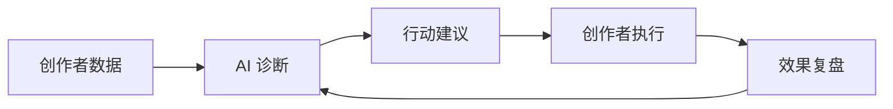

# 抖音创作者中心 AI 能力 PRD

版本：V0.1 核心理念版  
日期：2026-06-28  
状态：草案

## 1. 产品定位

将抖音创作者中心从“数据查看后台”升级为“AI 创作者运营伙伴”。

AI 不作为某个单点功能存在，而是作为一层动态智能系统，基于创作者自身数据、账号阶段、内容类型和当前问题，自动加载最适合的分析模块，并通过对话 Agent 帮创作者理解问题、制定行动、持续复盘。

## 2. 核心理念

不同创作者的问题不是同一种问题，所以 AI 不能被设计成固定入口或固定工具。

创作者真正需要的不是“更多数据”，而是：

- 我现在最重要的问题是什么
- 为什么会出现这个问题
- 下一条内容、下一场直播、下一周运营应该怎么做
- 做完之后效果有没有变好

因此，AI 的核心价值不是生成内容，而是把数据转化为个性化判断和行动建议。

## 3. 目标用户

首版面向三类典型创作者：

| 用户类型 | 核心诉求 | 主要问题 |
|---|---|---|
| 新手内容创作者 | 找到方向，提升基础内容质量 | 不知道拍什么、不知道为什么数据差 |
| 增长期视频创作者 | 稳定增长，突破瓶颈 | 播放波动、涨粉变慢、爆款不可复制 |
| 电商/直播创作者 | 提升转化和经营效率 | 直播复盘弱、商品转化差、话术和节奏不稳定 |

## 4. 核心机制

产品由两部分组成：

### 4.1 动态分析模块系统

系统根据创作者画像和实时数据，自动加载不同 AI 模块。

| 创作者状态 | 应加载模块 |
|---|---|
| 新手创作者 | 选题建议、内容结构诊断、发布节奏建议 |
| 增长期创作者 | 爆款复盘、流量波动分析、粉丝转化诊断 |
| 瓶颈期创作者 | 下滑原因分析、内容实验计划、账号定位建议 |
| 电商/直播创作者 | 转化漏斗分析、直播复盘、货品与话术建议 |
| 系列内容创作者 | 系列规划、追更率分析、评论情绪洞察 |

动态模块不应以“功能列表”形式堆给用户，而应由系统主动判断：此刻这个创作者最需要哪几个模块。

### 4.2 基于创作者数据的 AI Chat Agent

Agent 不是通用聊天机器人，而是创作者的个人数据顾问。

它需要能回答：

- 我最近为什么涨粉变慢？
- 哪几条视频最值得复盘？
- 我下一条视频应该拍什么？
- 我的粉丝更喜欢什么内容？
- 这周我最该优化什么？
- 我按照建议改了以后，效果有没有提升？

Agent 的回答必须尽量基于创作者自己的数据，并清楚区分“数据事实”和“AI 推测”。

## 5. P0 能力

首版最核心能力只做三件事。

### 5.1 账号诊断

基于近 7 天和近 30 天数据，识别创作者当前最关键的问题，例如：

- 播放下滑
- 完播率差
- 转粉率低
- 互动下降
- 直播转化弱
- 更新节奏不稳定

验收标准：系统能输出 1 个主问题和最多 3 个次级问题，并给出对应数据依据。

### 5.2 行动建议

每次只输出 1-3 个最优先行动，不泛泛而谈。

每条建议必须包含：

- 为什么建议做这件事
- 对应的数据依据
- 具体怎么执行
- 预期观察指标

验收标准：创作者看完建议后，可以直接知道下一条内容或下一场直播要怎么调整。

### 5.3 复盘闭环

AI 给出建议后，需要追踪创作者是否执行，以及执行后的数据变化。

核心链路：

验收标准：系统能在下一轮复盘中说明“建议是否被执行、指标是否变化、下一步是否需要调整”。

## 6. 产品原则

1. AI 不替代创作者，而是增强创作者判断力。
2. 不输出空泛建议，所有建议尽量绑定创作者自己的数据。
3. 不追求一次性回答所有问题，而是持续陪伴创作者成长。
4. AI 要主动判断优先级，而不是把所有数据都解释一遍。
5. 所有结论要区分“数据事实”和“AI 推测”，避免黑盒感。
6. AI 建议必须形成闭环，不能只给一次性答案。

## 7. MVP 形态

首版产品建议命名为：

**AI 创作者诊断台**

包含三个入口：

| 入口 | 说明 |
|---|---|
| 今日账号状态 | 用一句话告诉创作者当前账号是否健康，最主要问题是什么 |
| 本周最该做的 3 件事 | 给出最高优先级行动，而不是完整数据报告 |
| 问问我的创作顾问 | 基于个人数据的 AI Chat Agent |

## 8. 成功标准

核心指标不应只看 AI 使用次数，而应看 AI 是否真的帮助创作者变好。

| 指标 | 含义 |
|---|---|
| AI 建议采纳率 | 创作者是否愿意按照 AI 建议行动 |
| 创作者次周留存提升 | AI 是否提升创作者持续使用创作者中心的意愿 |
| 内容发布频率提升 | AI 是否降低创作决策成本 |
| 完播率、互动率、转粉率改善 | AI 是否对内容质量产生实际帮助 |
| “建议有用”反馈率 | 创作者对建议质量的主观判断 |
| 复盘链路完成率 | 是否形成建议、执行、结果、再建议的循环 |

## 9. 能力边界

AI 可以做：

- 解释创作者自身数据
- 识别当前最关键问题
- 给出个性化行动建议
- 复盘建议执行后的效果
- 帮助创作者形成内容实验计划

AI 不应做：

- 承诺播放量、涨粉量或收益结果
- 暗示可操控平台算法
- 用不透明逻辑给出绝对判断
- 在缺少数据时伪装成确定结论
- 用统一模板替代个性化分析

## 10. 一句话总结

这不是“给创作者中心加一个 AI 功能”，而是让创作者中心从静态数据后台，进化为一个能理解创作者、判断问题、给出行动并持续复盘的智能运营系统。

