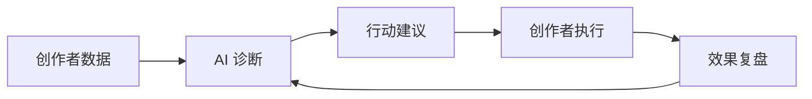

# 抖音创作者中心 AI 能力 PRD

版本：V0.2 访谈驱动版  
日期：2026-06-28  
状态：草案

## 1. 产品定位

将抖音创作者中心从“数据查看后台”升级为“AI 创作者运营伙伴”。

AI 不作为某个单点功能存在，而是作为一层动态智能系统，基于创作者自身数据、账号阶段、内容类型、创作者类型和当前问题，自动加载最适合的分析模块，并通过对话 Agent 帮创作者理解问题、制定行动、持续复盘。

核心目标不是让创作者多看数据，而是让创作者更快知道：

- 当前最重要的问题是什么
- 为什么会出现这个问题
- 下一条内容、下一轮选题会或下一周运营应该怎么做
- 做完之后效果有没有变好

## 2. 用户访谈结论

现有 PDF 访谈直接覆盖两类人群，另外三类作为产品扩展假设保留，需要后续用更多访谈、日志和灰度数据验证。

| 证据级别 | 创作者类型 | 访谈/假设来源 | 最关注什么 | 当前痛点 |
|---|---|---|---|---|
| 直接访谈证据 | 短剧选题/收益型 | 短剧制作方 / 内容选题参与者 | 流水、近 1-2 周市场风向、题材热度、收益复盘 | 依赖人工刷剧和团队小会，题材分得不够细，后台泛工具价值低 |
| 直接访谈证据 | 个人日常/异常解释型 | 个人自拍视频 / 日常向创作者 | 流量异常、粉丝画像、合集整理、标签/违规/非原创解释 | 数据只告诉结果，不解释原因；完播低、互动少、2 秒流失无法直接指导修改 |
| 产品扩展假设 | 增长复盘型 | 由“数据有波动、需要复制有效动作”扩展 | 爆款为什么好、日常内容为什么弱、转粉承接 | 爆款不可复制，评论深度高但回访弱 |
| 产品扩展假设 | 瓶颈修复/实验型 | 由“持续下滑、需要实验路径”扩展 | 下滑原因、定位重估、低变量实验 | 容易把问题归因到单一指标，缺少可观测实验 |
| 产品扩展假设 | 系列合集/老粉运营型 | 由“追更、合集、老粉互动”扩展 | 追更率、合集承接、评论二次选题 | 老粉互动没有沉淀成下一期内容，新粉承接弱 |

访谈结论：不同创作者对创作者中心的需求并不相同。短剧制作方更关注高时效收益、市场风向和题材判断，个人创作者更需要低门槛解释流量波动和下一步动作。因此，AI 能力不应被设计成单一入口或固定功能，而应成为一套可扩展、可卸载、可自动路由的分析模块系统。

## 3. 核心机制

产品由三层组成：

| 层级 | 作用 |
|---|---|
| 创作者画像层 | 识别领域、阶段、内容形态、目标、创作者类型和当前瓶颈 |
| 动态分析模块层 | 按创作者类型、指标异常和加载模式选择诊断、复盘、选题、风险和行动模块 |
| AI Chat Agent 层 | 把数据事实、AI 推测和模块结果转译为可执行建议 |

### 3.1 模块加载模式

主界面左上角提供三种模式：

| 模式 | 说明 | 适合场景 |
|---|---|---|
| 少而准 | 每类默认加载 3-4 个最强相关模块 | 首屏诊断、快速决策 |
| 覆盖完整 | 展示该类型所有可用分析模块 | 深度复盘、团队讨论 |
| 动态阈值 | 类型只做权重，最终按指标异常、内容形态和瓶颈关键词排序加载 | 异常排查、灰度后真实数据 |

## 4. 动态模块矩阵

| 创作者类型 | 判断依据 | 重点关注 | 默认加载模块 | AI 输出 |
|---|---|---|---|---|
| 短剧选题/收益型 | 短剧制作、系列内容、流水/转化数据、题材复盘诉求 | 流水、题材热度、市场风向、收益复盘 | 短剧收益/题材雷达、爆款复盘、内容表现诊断、粉丝经营诊断 | 近 1-2 周题材判断、收益变化解释、下一轮选题变体 |
| 个人日常/异常解释型 | 个人自拍视频、流量异常、标签/违规/非原创困扰 | 异常原因、完播/互动断点、标签和受众变化 | 流量异常解释、内容表现诊断、标签/违规风险解释、发布节奏建议 | 低门槛原因解释、下一条可照做动作、风险排查清单 |
| 增长复盘型 | 播放有波动、爆款与日常差距大、转粉承接弱 | 爆款可复制性、流量波动、粉丝转化 | 爆款复盘、粉丝经营诊断、内容表现诊断、流量异常解释 | 可复用标题/开头/结尾模板、评论回访动作 |
| 瓶颈修复/实验型 | 多周期下滑、定位摇摆、发布节奏不稳 | 下滑原因、定位重估、低变量实验 | 瓶颈实验计划、流量异常解释、内容表现诊断、发布节奏建议 | 7 天实验计划、暂停项、观察指标 |
| 系列合集/老粉运营型 | 系列内容、合集承接、追更和老粉互动 | 追更率、合集组织、评论二次选题 | 系列合集运营、粉丝经营诊断、爆款复盘、发布节奏建议 | 下一期预告、评论驱动选题、合集承接动作 |

动态模块不应以“功能列表”形式堆给用户，而应由系统主动判断：此刻这个创作者最需要哪几个模块。

## 5. P0 能力

首版最核心能力只做三件事。

### 5.1 账号诊断

基于近 7 天和近 30 天数据，识别创作者当前最关键的问题，例如播放下滑、完播率差、转粉率低、互动下降、收益/转化异常、更新节奏不稳定、标签/违规风险。

验收标准：系统能输出 1 个主问题和最多 3 个次级问题，并给出对应数据依据。

### 5.2 行动建议

每次只输出 1-3 个最优先行动，不泛泛而谈。

每条建议必须包含：

- 为什么建议做这件事
- 对应的数据依据
- 具体怎么执行
- 预期观察指标

验收标准：创作者看完建议后，可以直接知道下一条内容、下一轮选题会或下一周运营要怎么调整。

### 5.3 复盘闭环

AI 给出建议后，需要追踪创作者是否执行，以及执行后的数据变化。

核心链路：

验收标准：系统能在下一轮复盘中说明“建议是否被执行、指标是否变化、下一步是否需要调整”。

## 6. MVP 形态

首版产品建议命名为：

**AI 创作者诊断台**

包含四类入口：

| 入口 | 说明 |
|---|---|
| 今日账号状态 | 用一句话告诉创作者当前账号是否健康，最主要问题是什么 |
| 模块加载模式 | 少而准、覆盖完整、动态阈值三种加载策略 |
| 行动队列 | 在 sidebar 打开完整 Kanban，看今天、下一步、本周、已完成动作 |
| 问问我的创作顾问 | 基于个人数据和已加载模块的 AI Chat Agent |

## 7. 成功标准

核心指标不应只看 AI 使用次数，而应看 AI 是否真的帮助创作者变好。

| 指标 | 含义 |
|---|---|
| AI 建议采纳率 | 创作者是否愿意按照 AI 建议行动 |
| 创作者次周留存提升 | AI 是否提升创作者持续使用创作者中心的意愿 |
| 内容发布频率提升 | AI 是否降低创作决策成本 |
| 完播率、互动率、转粉率、收益转化改善 | AI 是否对内容质量和经营效率产生实际帮助 |
| “建议有用”反馈率 | 创作者对建议质量的主观判断 |
| 复盘链路完成率 | 是否形成建议、执行、结果、再建议的循环 |

## 8. 能力边界

AI 可以做：

- 解释创作者自身数据
- 识别当前最关键问题
- 给出个性化行动建议
- 复盘建议执行后的效果
- 帮助创作者形成内容实验计划
- 在证据不足时明确标注产品假设或低置信度判断

AI 不应做：

- 承诺播放量、涨粉量或收益结果
- 暗示可操控平台算法
- 用不透明逻辑给出绝对判断
- 在缺少数据时伪装成确定结论
- 用统一模板替代个性化分析

## 9. 后续验证

- 为五类矩阵补充访谈证据矩阵：样本背景、关键原话、行为、痛点、模块需求。
- 用灰度数据验证三种加载模式的使用率、建议采纳率和负反馈率。
- 当前不重新生成 PDF；待代码和 Markdown 口径确认后，再输出新版正式文档。
